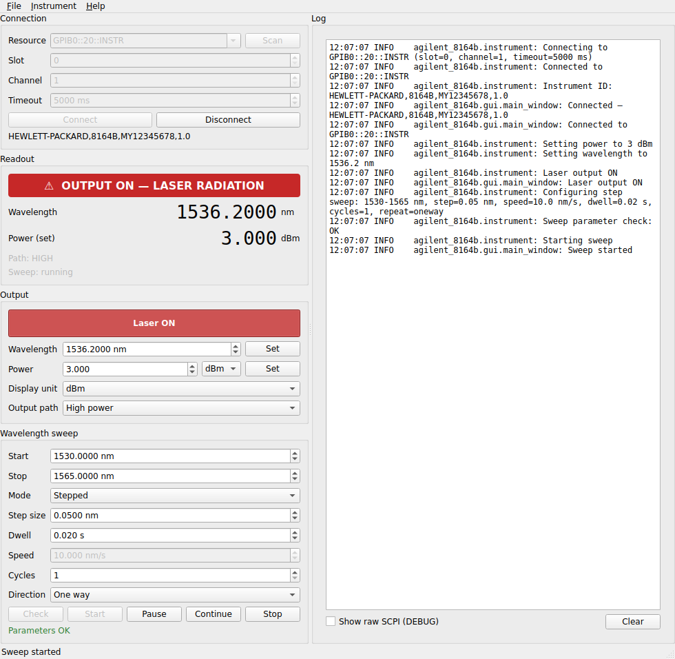

# agilent-8164b

Python driver for the Keysight/Agilent 8164B Lightwave Measurement System
(tunable laser source module), built on [PyVISA](https://pyvisa.readthedocs.io/)
and the SCPI command set from the mainframe programming guide.

## Requirements

- Python >= 3.8
- [PyVISA](https://pyvisa.readthedocs.io/) plus a VISA backend:
  NI-VISA, Keysight IO Libraries Suite, or [pyvisa-py](https://pyvisa-py.readthedocs.io/)
- The appropriate interface driver for how you talk to the instrument
  (GPIB, LAN/VXI-11, or LAN/socket)

## Installation

Install from source in editable mode:

```bash
git clone https://github.com/bongkokwei/agilent-8164b.git
cd agilent-8164b
pip install -e .
```

To also pull in the extra dependencies used by the example scripts:

```bash
pip install -e ".[examples]"
```

## Usage

```python
from agilent_8164b import Agilent8164B

with Agilent8164B("GPIB0::21::INSTR", slot=0, channel=1) as laser:
    print(laser.identify())
    laser.set_wavelength_nm(1550.0)
    laser.set_power(1.5, unit="dBm")
    laser.set_output_path("high")  # or "lowsse", "both_high", "both_low"
    laser.laser_on()
    print("Wavelength (nm):", laser.get_wavelength_nm())
    print("Power:", laser.get_power(), laser.get_power_unit())
    print("Output path:", laser.get_output_path())
    print("Error queue:", laser.flush_errors())
```

### API overview

| Method | Description |
| --- | --- |
| `identify()` | Query `*IDN?` |
| `reset()` | Send `*RST` |
| `laser_on()` / `laser_off()` / `is_laser_on()` | Control/query output state |
| `set_wavelength_nm(nm)` / `get_wavelength_nm()` | Set/get wavelength in nm |
| `set_power(value, unit)` / `get_power()` | Set/get output power (`dBm`, `mW`, `uW`, `nW`) |
| `set_power_unit(unit)` / `get_power_unit()` | Set/get the power display unit |
| `set_output_path(path)` / `get_output_path()` | Set/get output path (`high`, `lowsse`, `both_high`, `both_low`) — for dual-output modules |
| `configure_sweep(start_nm, stop_nm, ...)` | Configure the module's built-in wavelength sweep (`mode='step'` or `'continuous'`, `repeat='oneway'` or `'twoway'`) |
| `start_sweep()` / `stop_sweep()` / `pause_sweep()` / `continue_sweep()` | Control a configured sweep |
| `is_sweeping()` | True while the sweep is running |
| `check_sweep_params()` | Validate the configured sweep, returns `"OK"` or a description of the problem |
| `check_errors()` / `flush_errors()` | Read the SCPI error queue |
| `close()` | Close the VISA session (also called automatically via `with`) |

## GUI

A PyQt6 control panel ships with the package:

```bash
pip install -e ".[gui]"
agilent-8164b-gui                       # or: python -m agilent_8164b.gui.app
```



*(Screenshot taken against the test suite's stubbed VISA session, hence the placeholder serial number.)*

The GUI is a front end to `Agilent8164B` and nothing more: every control maps
onto a method of that class, and everything it displays is read back from the
laser source module. It measures nothing, because the module has no detector.

- **Connection** — pick a VISA resource (`Scan` lists what the backend can see),
  set the slot, channel and timeout, then connect. The `*IDN?` response is shown
  underneath, and everything else stays disabled until a session is open.
- **Readout** — wavelength (`:WAV?`) and sweep state polled a few times a second,
  plus the output path. A red banner appears whenever the output is emitting.
  "Power (set)" is a `:SOUR:POW?` readback of the commanded power — it is the
  setpoint, not a measurement, and does not respond to anything downstream of
  the output connector.
- **Output** — laser on/off, wavelength, power (`dBm`/`mW`/`uW`/`nW`), the unit
  the instrument reports in, and the output path for dual-output modules.
- **Wavelength sweep** — the full `configure_sweep()` parameter set. `Check`
  runs `:WAV:SWE:CHEC?` and reports the problem in place; `Start` re-checks
  before it will start, so a bad range never reaches the hardware.
- **Log** — the driver's own log messages, with a tick box to include the raw
  SCPI traffic.

To record a transmission spectrum you need a power meter module and the
`:SENSe` subsystem, which this driver does not cover. `examples/wavelength_scan.py`
has the same limitation: the "power" column it writes is the source setpoint.

All instrument I/O runs on a worker thread, so the window never freezes while
the mainframe is answering. The output is switched off when you disconnect or
close the window, `Ctrl+Shift+O` is a panic "output off now", and enabling the
laser asks for confirmation (switch that off under *Instrument*).

Other command-line options: `--resource`, `--slot`, `--channel`,
`--poll-interval MS` (default 200), and `--debug` to log every SCPI exchange.

## Examples

See [`examples/wavelength_scan.py`](examples/wavelength_scan.py) for a
wavelength sweep script. It drives the module's native sweep engine
(`configure_sweep()` / `start_sweep()`) rather than stepping the wavelength
from the host. Edit the parameters in the `CONFIG` section at the top of the
file (VISA resource string, scan range, sweep mode/step/speed, output power,
and output path), then run:

```bash
python examples/wavelength_scan.py
```

The script starts a sweep, polls the wavelength while it runs, logs each
sample, and (unless disabled) writes the results to a CSV file. Note that its
power column is the source setpoint read back with `get_power()`, not a
measurement — see the note under [GUI](#gui).

## Logging

The driver logs through the standard `logging` module under the
`agilent_8164b` logger and stays silent until your application configures
logging. `INFO` reports connections and state changes (laser on/off, power,
wavelength, sweep control); `DEBUG` additionally shows every SCPI command
and response.

```python
import logging

logging.basicConfig(level=logging.INFO)          # or logging.DEBUG for raw SCPI
```

## Project layout

```
src/agilent_8164b/     # installable package
  __init__.py
  instrument.py        # Agilent8164B driver class
  gui/                 # PyQt6 control panel
    app.py             # CLI entry point (agilent-8164b-gui)
    main_window.py     # window, menus, worker thread wiring
    widgets.py         # connection/readout/output/sweep panels
    worker.py          # instrument worker (all VISA I/O lives here)
examples/
  wavelength_scan.py   # wavelength scan example with editable parameters
tests/
  conftest.py          # stubbed VISA session used by the tests
  test_gui.py          # GUI tests
```

## Tests

The tests drive the real window and the real driver, stubbing only the VISA
session underneath, so the SCPI the driver builds is checked for real. They
need neither hardware nor a display:

```bash
pip install -e ".[dev]"
QT_QPA_PLATFORM=offscreen pytest        # omit the prefix on a desktop
```

## License

MIT
